### Procedure
1.  Read the Objectives and Apparatus, hover over the Description and Click on Next.  
    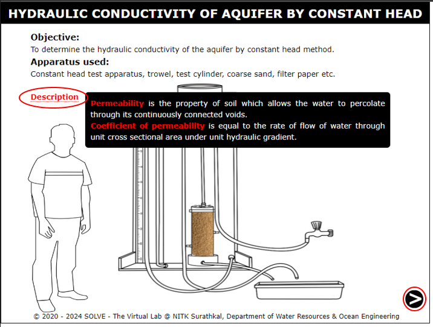

2.  Click on the vernier caliper to measure the diameter of the mould and then find the area.
    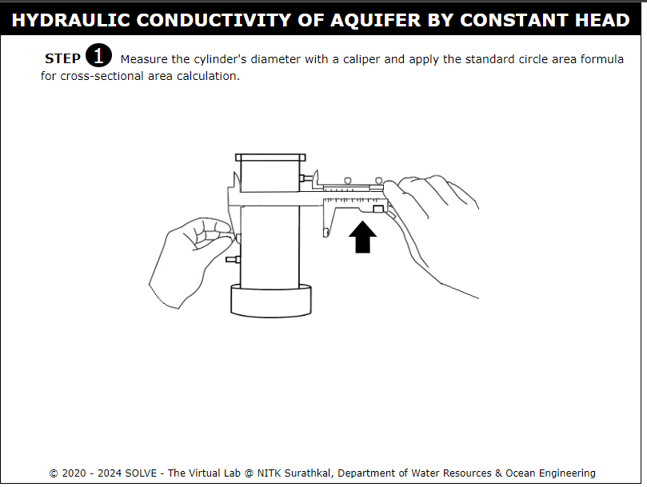

3.  Click on the "ON" button to on the weighing machine and then weigh one kilogram of coarse soil and measure it.
    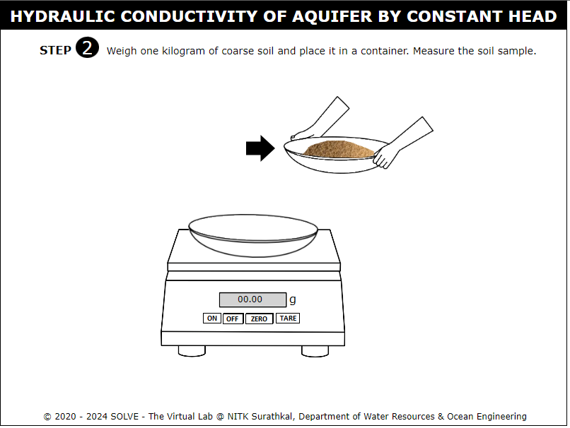

4.  Click on the filter paper to place it inside the mould.
    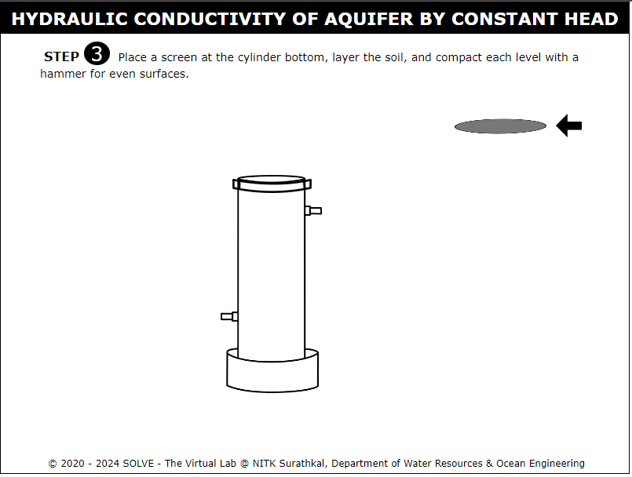

5.  Click on the trowel to pour the soil sample into the mould and then click on the hand with rod.
    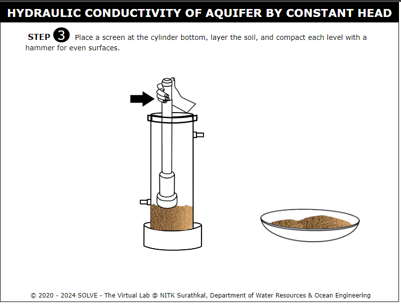

6.  Click on filter paper to place it on top of the soil and then place a porous stone on top of it.
    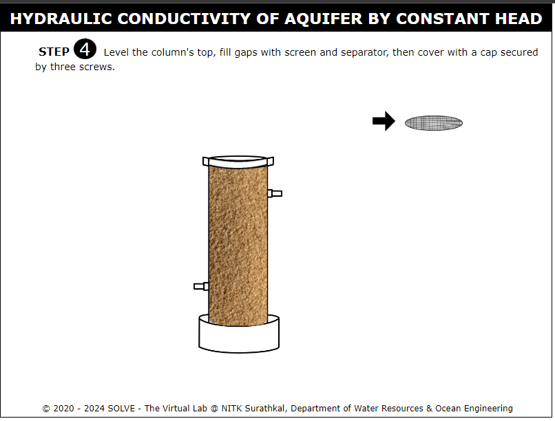

7. Click on the top plate to place it above the mould and then click on the nut to make the permeameter completely leak proof.
    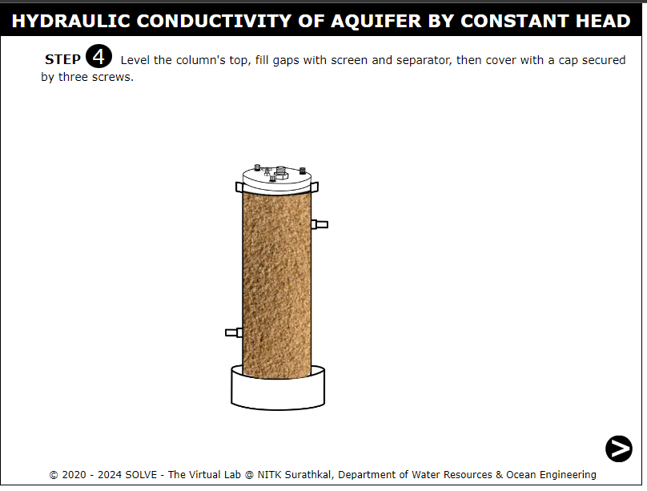

8. Weigh the remaining soil.
    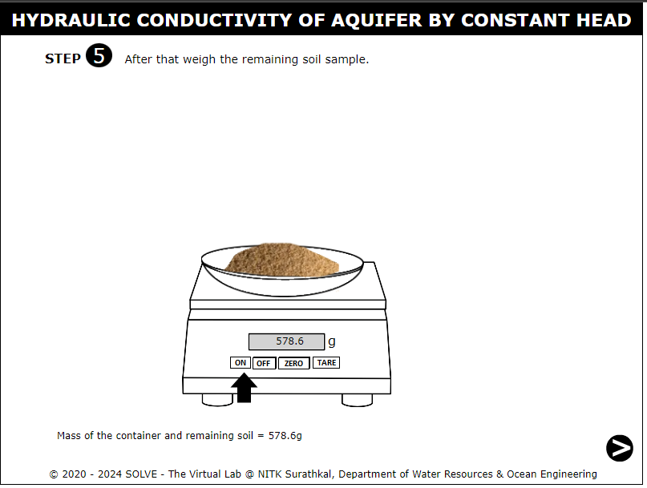

9. Click on the hand to connect the pipe to the outlet of the permiameter.
    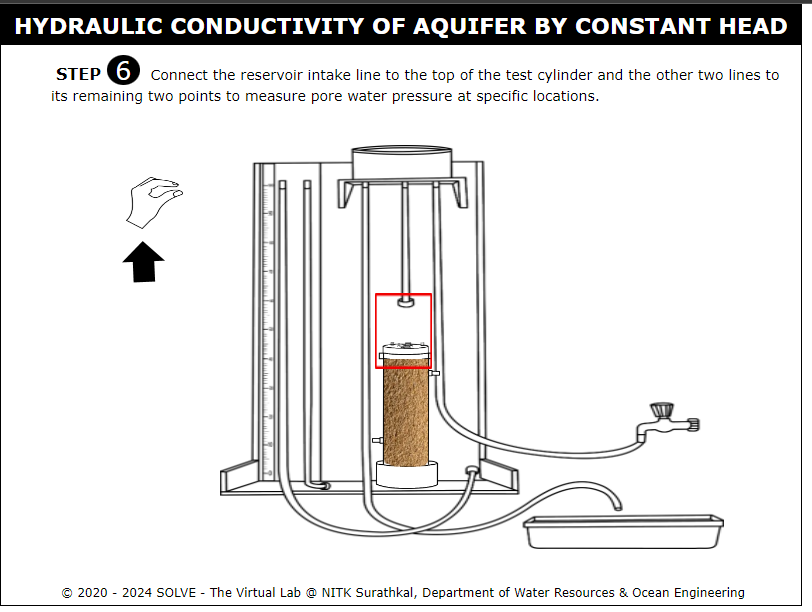
10.  Click on the valve to maintain a constant reservoir water level by allowing excess water to discharge through the tube.
    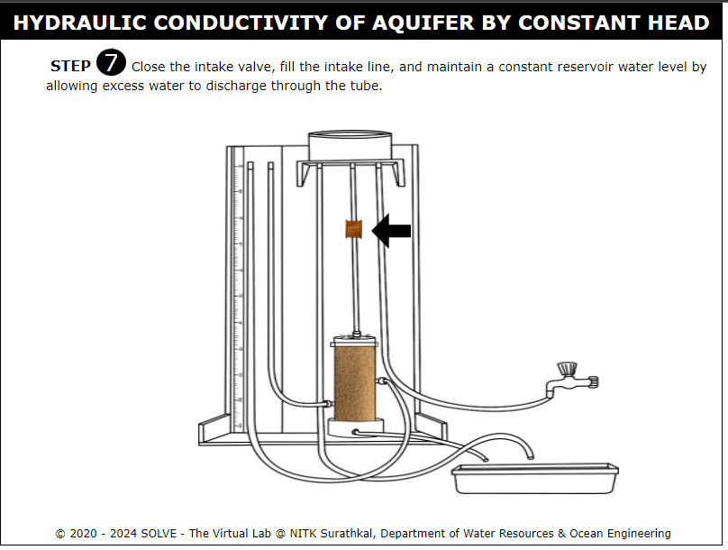

11. Click on tap to allow the water flow to the sample.
    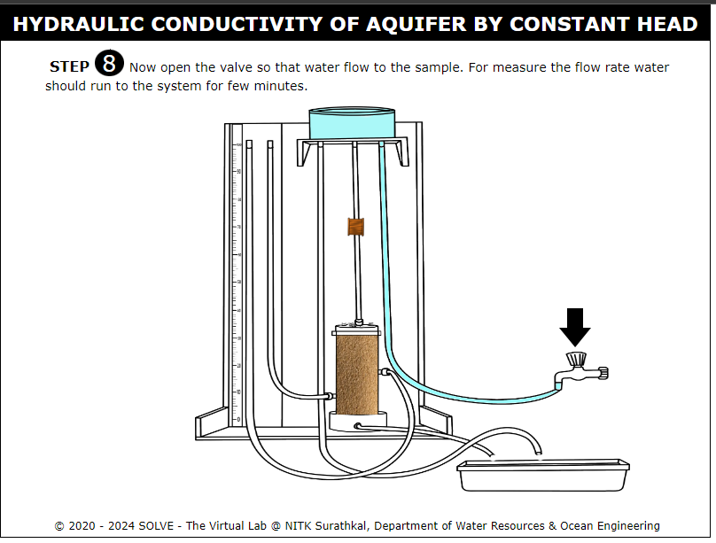

12. Click on the "ON" button to on the weighing machine and then weigh the empty beaker.
    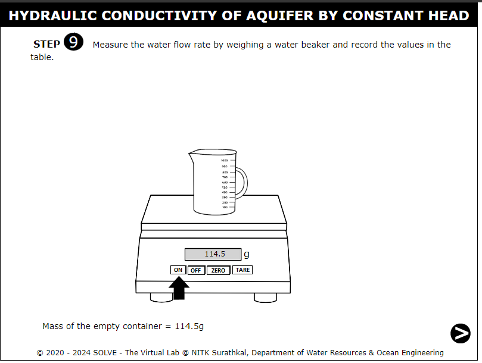

13. Click on the pipe and then click on the stop watch to collect 300 ml of water.
    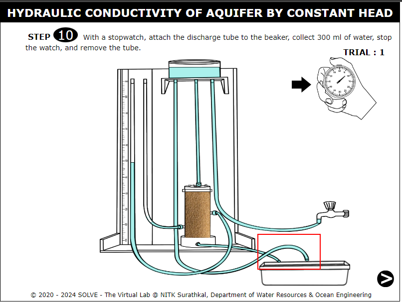

14. Click on the "ON" button to on the weighing machine and then measure the mass of the beaker with water.
    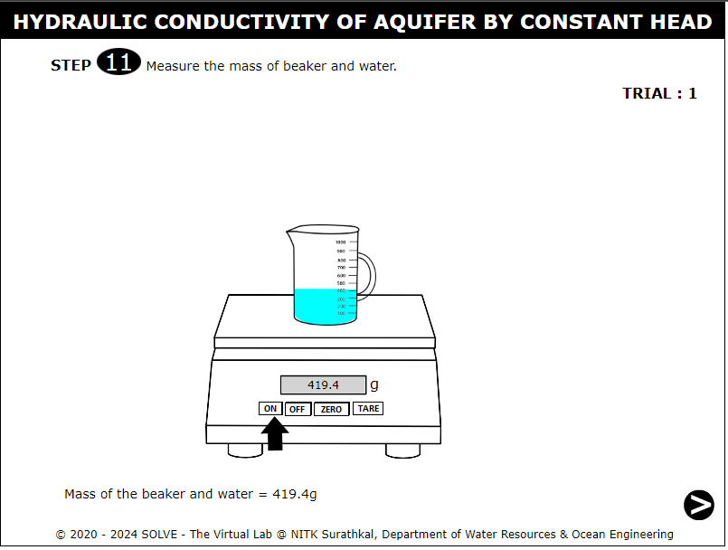

15. Note down the readings.
    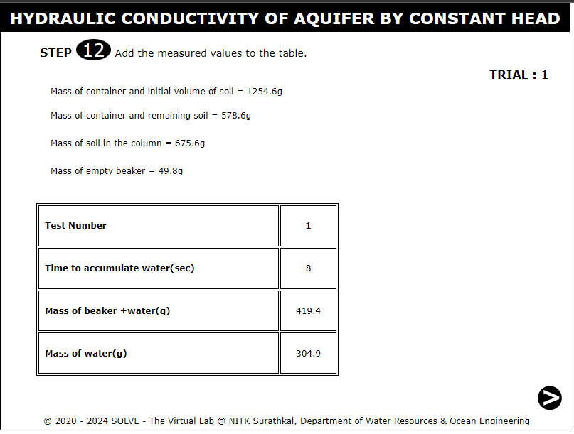

16. Repeat the steps for 3 trials and then note down the readings.
    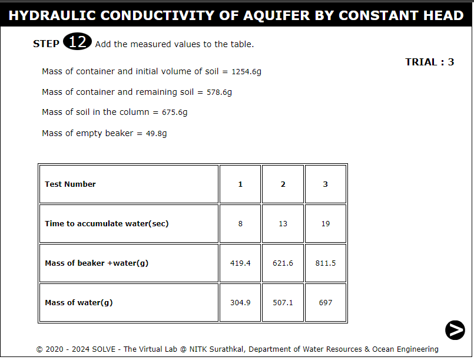

17. Click on the pipe to measure the total head at both top and bottom manometers.
    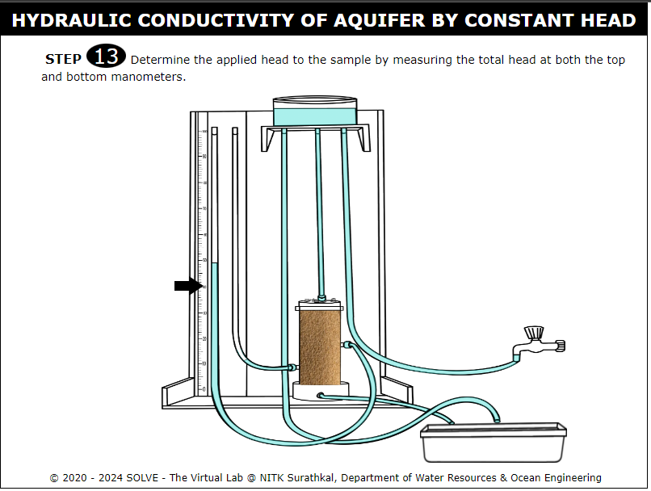

18. Observation and calculation.
    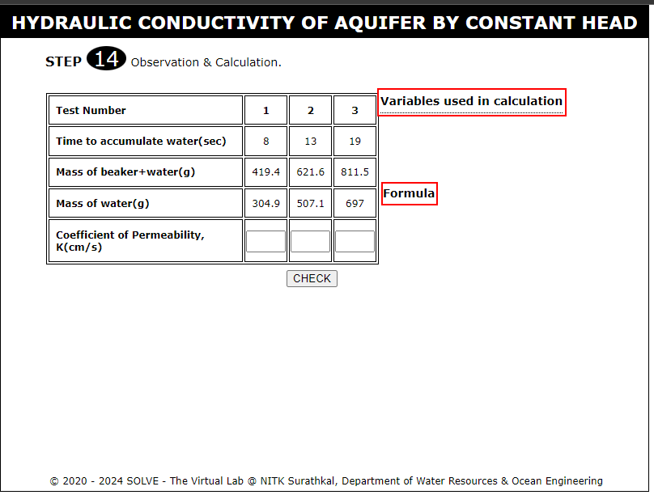